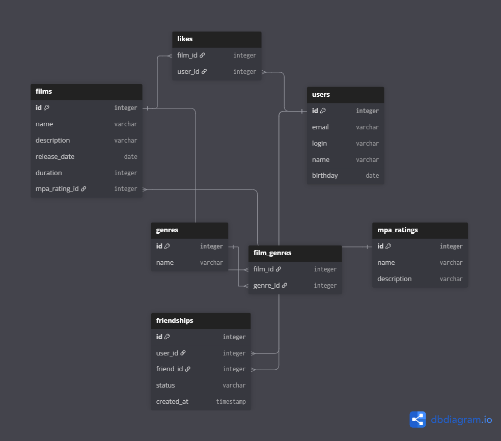

# java-filmorate

# Схема базы данных



### Описание таблиц

- **`users`** — хранит информацию о пользователях (id, email, login, name, birthday).
- **`films`** — хранит информацию о фильмах (id, name, description, release_date, duration, mpa_rating_id).
- **`genres`** — справочник жанров (id, name).
- **`film_genres`** — связывает фильмы и жанры (film_id, genre_id). Обеспечивает отношение «многие ко многим».
- **`mpa_ratings`** — справочник рейтингов MPA (id, name, description).
- **`friendships`** — хранит заявки в друзья и подтверждённые дружбы (user_id, friend_id, status, created_at).
- **`likes`** — хранит лайки пользователей на фильмы (film_id, user_id).

### Примеры SQL-запросов

**1. Получить все фильмы**

```sql
SELECT * FROM films;
```

**2. Получить фильм по id**

```sql
SELECT * FROM films WHERE id = ?;
```

**3. Получить все жанры конкретного фильма**

```sql
SELECT g.name
FROM genres g
JOIN film_genres fg ON g.id = fg.genre_id
WHERE fg.film_id = ?;
```

**4. Получить топ-10 популярных фильмов**

```sql
SELECT f.*, COUNT(l.user_id) AS likes_count
FROM films f
LEFT JOIN likes l ON f.id = l.film_id
GROUP BY f.id
ORDER BY likes_count DESC
LIMIT 10;
```

**5. Получить список общих друзей для двух пользователей**

```sql
SELECT u.*
FROM users u
JOIN friendships f1 ON u.id = f1.friend_id AND f1.user_id = 1 AND f1.status = 'CONFIRMED'
JOIN friendships f2 ON u.id = f2.friend_id AND f2.user_id = 2 AND f2.status = 'CONFIRMED';
```

**6. Получить список подтвержденных друзей пользователя**

```sql
SELECT u.*
FROM users u
JOIN friendships f ON u.id = f.friend_id
WHERE f.user_id = ? AND f.status = 'CONFIRMED'
UNION
SELECT u.*
FROM users u
JOIN friendships f ON u.id = f.user_id
WHERE f.friend_id = ? AND f.status = 'CONFIRMED';
```

**7. Получить водящие заявки в друзья для пользователя**

```sql
SELECT u.*
FROM users u
JOIN friendships f ON u.id = f.user_id
WHERE f.friend_id = ? AND f.status = 'PENDING';
```